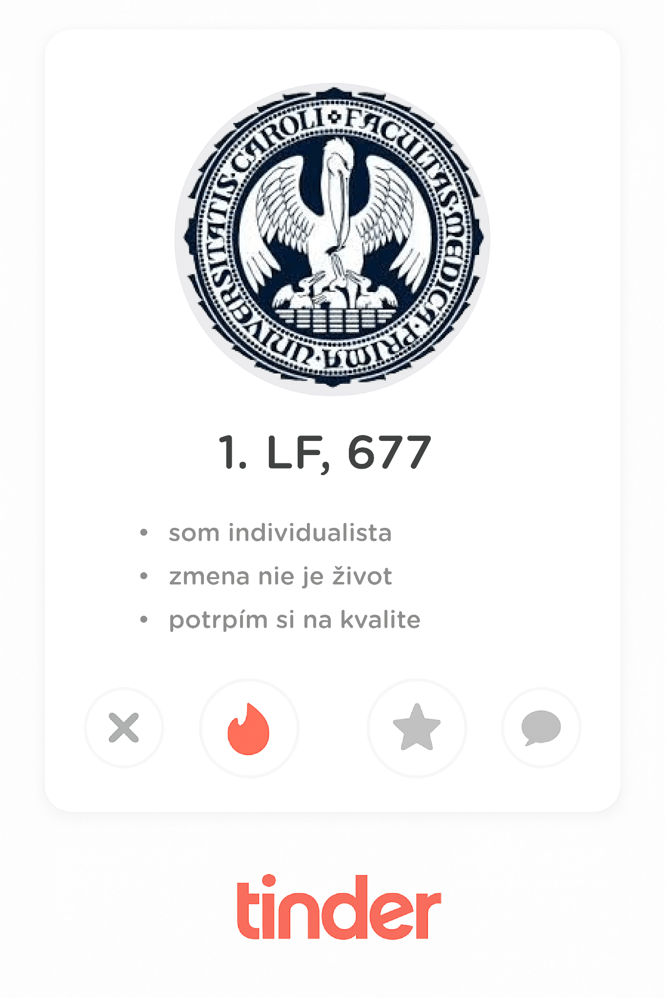
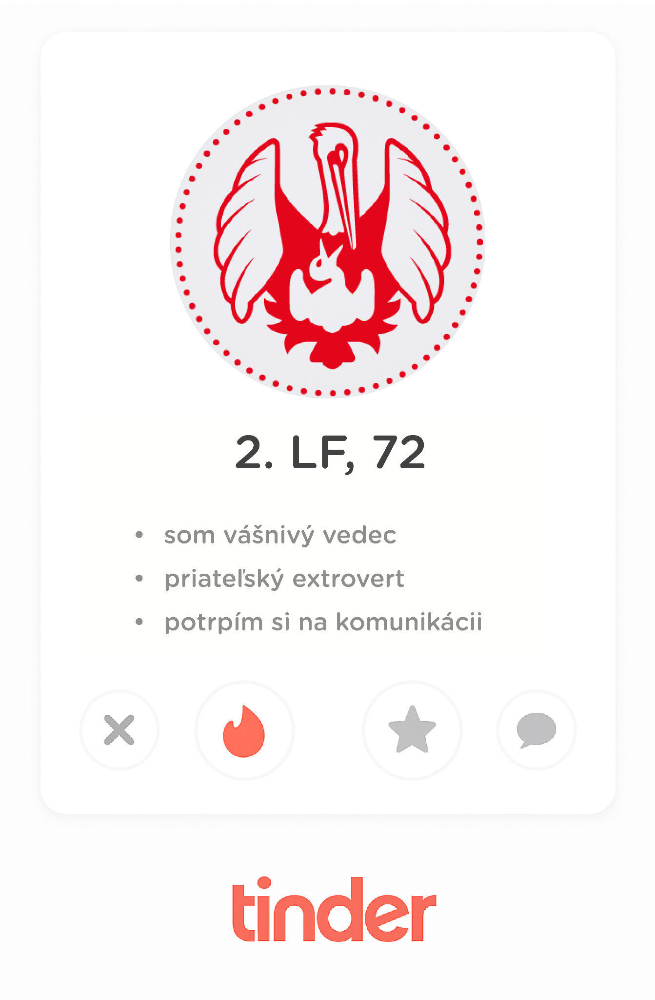
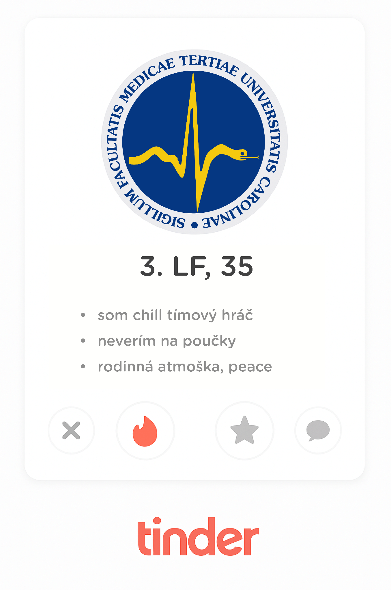

| Kritérium        | 1\. LF UK (Prvá lekárska fakulta)  | 2\. LF UK (Druhá lekárska fakulta)           | 3\. LF UK (Tretia lekárska fakulta)          |
| ---------------- | ---------------------------------- | -------------------------------------------- | -------------------------------------------- |
| Povesť           | Klasika a tradícia               | Veda a Motol                               | Inovácia a komunikácia                     |
| Veľkosť          | Najväčšia (~350 prijatých)         | Stredná (~180 prijatých)                     | Najmenšia (~160 prijatých)                   |
| Prijímačky       | 1-kolové: Písomný test             | 2-kolové: Test + Ústny pohovor               | 2-kolové: Test + Ústny pohovor               |
| Predmety v teste | Biológia, Chémia, Fyzika           | Biológia, Chémia, Fyzika + Test predpokladov | Biológia, Chémia, Fyzika (niekedy s výberom) |
| Spôsob výučby    | Klasický, predmetový               | Klasický s dôrazom na vedu a prax            | Modulový, integrovaný, PBL                   |
| Hlavná nemocnica | Všeobecná fakultní nemocnice (VFN) | Fakultní nemocnice v Motole (FN Motol)       | Fakultní nemocnice Královské Vinohrady       |
| Atmosféra        | Anonymnejšia, prestížna            | Komunitná, vedecká, náročná                  | Rodinná, moderná, interaktívna               |

## 1. LF UK (Prvá lekárska fakulta)
Najstaršia lekárska fakulta v strednej Európe a najväčšia z trojice. Ak si predstavuješ medicínu ako seriózne štúdium tradičných predmetov v historických budovách, 1. LF je presne pre teba.
### 📃 Prijímačky
Jednokolové: Rozhoduje len výsledok písomného testu.
#### Štruktúra
Jeden rozsiahly test z biológie, chémie a fyziky (spolu 210 otázok, 70 z každého predmetu). Test je zameraný na fakty a teóriu.
Pohovor: Pre všeobecné lekárstvo sa ústny pohovor štandardne nekoná. Je to teda ideálna voľba pre excelentných "testových" študentov, ktorí sa nechcú stresovať ústnou skúškou.
### 🧑‍🏫 Spôsob výučby
Klasický (predmetový): Štúdium je rozdelené na tradičné predmety. Prvé dva roky máš anatómiu, histológiu, biofyziku. Neskôr patológiu, farmakológiu atď. Predmety sú oddelené a na konci každého ťa čaká skúška.
### 💉 Prax
Prax prebieha v niekoľkých nemocniciach po celej Prahe, primárne vo Všeobecnej fakultnej nemocnici na Karlovom námestí. Uvidíš obrovské množstvo pacientov a široké spektrum diagnóz.
### 🧑‍🎓 Atmoška
Vzhľadom na veľký počet študentov je atmosféra anonymnejšia. Si jedným z mnohých. Vyžaduje to vysokú mieru samostatnosti, sebadisciplíny aj súťaživosti.
### 🤓 Je pre teba ideálna? Ak si študent, ktorý
Preferuje klasický, rokmi overený systém výučby.
Je silný v testoch a chce sa vyhnúť ústnemu pohovoru na prijímačkách.
Je samostatný a nevadí mu väčšia anonymita.
Chce zažiť "tradičnú" medicínu na najstaršej fakulte.

## 2. LF UK (Druhá lekárska fakulta)
Často vnímaná ako fakulta so silným vedeckým zameraním a úzkym prepojením na FN Motol, jednou z najväčších nemocníc v Európe. Hoci je známa špičkovou pediatriou, jej zameranie je omnoho širšie a pokrýva medicínu v plnom rozsahu.
### 📃 Prijímačky
Dvojkolové: Kľúčový rozdiel oproti 1. LF.
1. kolo: Písomný test z biológie, chémie, fyziky a test všeobecných predpokladov pre štúdium.
2. kolo: Postupujúci sú pozvaní na ústny pohovor, kde komisia zisťuje motiváciu, komunikačné schopnosti, etické uvažovanie a celkový prehľad.
### 🧑‍🏫 Spôsob výučby
Klasický s modifikáciami: Systém je prevažne predmetový ako na 1. LF, ale kladie sa väčší dôraz na vedecké myslenie a skorší kontakt s klinickou praxou. Prepojenie s Motolom je cítiť od prvého ročníka.
### 💉 Prax
Prakticky celá výučba je sústredená v obrovskom areáli FN Motol. To je veľká výhoda – všetko máš na jednom mieste. Fakulta je svetovou špičkou v pediatrických odboroch, ale poskytuje excelentnú výučbu vo všetkých odboroch.
### 🤝 Atmoška
Je menšia ako 1. LF, čo prispieva k oveľa komunitnejšej a priateľskejšej atmosfére. Študenti sa navzájom poznajú, rovnako ako aj svojich vyučujúcich. Je považovaná za akademicky veľmi náročnú, ale zároveň podporujúcu.
### 🤓 Je pre teba ideálna? Ak si študent, ktorý
Má záujem o vedu a výskum.
Je dobrý komunikátor a nebojí sa ústneho pohovoru.
Oceňuje komunitnú atmosféru a chce mať všetku prax na jednom mieste.
Zvažuje kariéru v pediatrii (ale nie je to podmienka).

## 3. LF UK (Tretia lekárska fakulta) – "Inovácia a komunikácia" 🩻
Najmladšia a najmenšia z trojice, ktorá sa od ostatných radikálne odlišuje svojím moderným prístupom k výučbe. Je to fakulta pre tých, ktorí chcú medicínu študovať inak.
### 📃 Prijímačky
Dvojkolové: Podobne ako na 2. LF.
1. kolo: Písomný test z biológie, chémie a voliteľnej časti (často fyzika alebo matematika).
2. kolo: Ústny pohovor, ktorý je pre túto fakultu kľúčový. Často zahŕňa interpretáciu populárno-náučného textu, diskusiu o etických dilemách a overenie motivácie. Komunikácia je tu absolútne prvoradá.
### 🧑‍🏫 Spôsob výučby
Modulový a integrovaný: Toto je jej najväčšia odlišnosť. Namiesto oddelených predmetov sa učíš v logických blokoch (moduloch), napr. "Pohybový aparát", kde máš spojenú anatómiu, histológiu, fyziológiu a biochémiu daného systému. Dôraz sa kladie na problémovo-orientovanú výučbu a komunikačné zručnosti.
### 💉 Prax
Výučba prebieha hlavne vo Fakultnej nemocnici Královské Vinohrady. Fakulta kladie veľký dôraz na prevenciu, hygienu, etiku a celostný (holistický) prístup k pacientovi.
### 🫂 Atmoška
Vďaka najmenšiemu počtu študentov je atmosféra takmer rodinná. Vzťahy medzi študentmi a vyučujúcimi sú veľmi blízke a neformálne. Je to ideálne prostredie pre tímových hráčov.
### 🤓 Je pre teba ideálna? Ak si študent, ktorý
Chce medicínu chápať v súvislostiach, nie ako oddelené predmety.
Je komunikatívny, empatický a rád pracuje v tíme.
Preferuje moderné, interaktívne metódy učenia pred pasívnym memorovaním.
Hľadá priateľskú a podporujúcu komunitu.

Máš stále problém s výberom? Poďme sa pozrieť, ako by vyzerala každá fakulta na Tindri:


  
  
  


Nech sa vydáš na akúkoľvek cestu, môžeš rátať s tým, že Premedis ťa na ňu poriadne pripraví. Vďaka kurzom prispôsobeným pre všetky fakulty môžeš mať istotu, že ti nič nebude chýbať na tvoj deň D. Veľa šťastia a dúfame, že sa vidíme!
